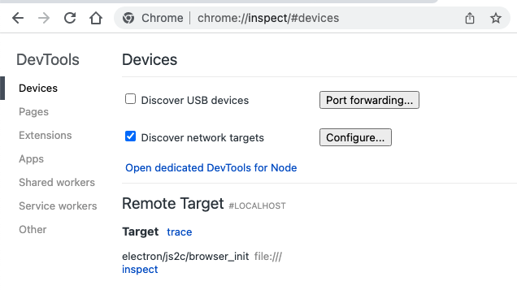
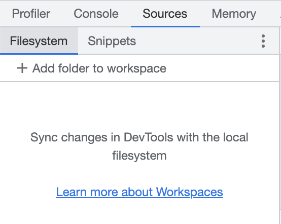

# Template-Electron

## Configured Tools

- [Electron](https://www.electronjs.org/)
- [Electron Forge](https://www.electronforge.io/)
- [TypeScript](https://www.typescriptlang.org/)
- [React](https://reactjs.org/)
- [Emotion](https://emotion.sh/)
- [Webpack](https://webpack.js.org/) for electron's renderer process
- [Babel](https://babeljs.io/) for electron's main process
- [ESLint](https://eslint.org/) for both JS and TS files
- [Prettier](https://prettier.io/)
- [husky](https://github.com/typicode/husky)

## NPM Commands

- `npm run clean`
  
    Clean up build directories

- `npm run start`

    Launch app and builder daemons in development mode

- `npm run package`

  Transpile sources and run `electron-forge package`

- `npm run make`

  Transpile sources and run `electron-forge make`

- `npm run test`

  Run test

- `npm run lint`

  Run lint

# Debugging Electron Main Process

`npm run start` enables electron's debugging feature with port 5858.

You can connect the chrome debugger to this port as follows.

1. Access to [chrome://inspect](chrome://inspect)
2. Check `Discover network targets`
3. Click `Configure...` and add `localhost:5858` to `Target discovery Settings`
4. You can see electron process in `Remote Target` list, and click "inspect"

If you can't see any files in debugger, add it by yourself from `Add folder to workspace`

